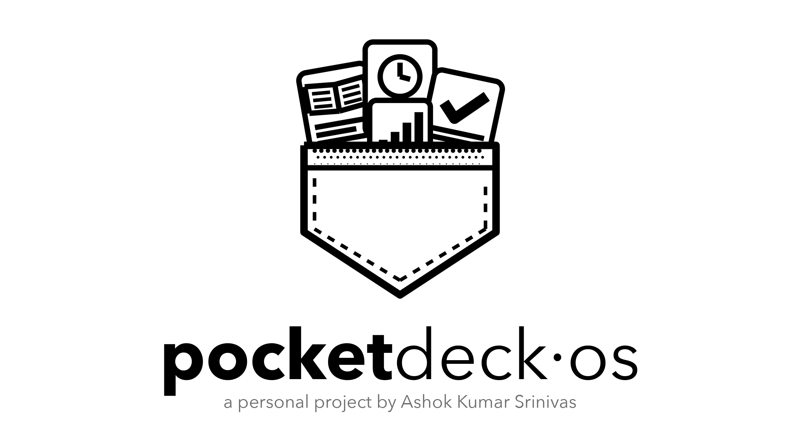
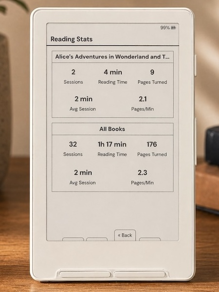

<p align="center">
  
</p>

# PocketDeck-OS

**A personal project by Ashok Kumar Srinivas** · version 1.0.0

PocketDeck-OS is e-reader firmware for the Xteink X3 that keeps the reader in
your pocket and adds a small deck of daily tools: Pomodoro, World Clock, Habit
Tracker, spaced-repetition Flashcards, Daily Quote, Knowledge (paged Q&A), an
offline Kannada Panchanga, and Today (to-dos). Reading Stats include a Library
dashboard, and there are eight UI themes including the new PocketDeck theme. See [docs/productivity-tools.md](pocketdeck-os-main/docs/productivity-tools.md) and the
[screenshot walkthrough](pocketdeck-os-main/docs/screenshots/README.md) of every screen.

It is built on [CrossInk](https://github.com/uxjulia/CrossInk), which is itself
a fork of [CrossPoint Reader](https://github.com/crosspoint-reader/crosspoint-reader).
All of CrossInk's reading, WiFi, OTA and file-transfer features are kept as they
are; the notes below describe them.


## Installing PocketDeck-OS

PocketDeck-OS ships as a single firmware image per device family, plus an
optional SD-card data pack for the tools.

| Device | Firmware file |
| --- | --- |
| Xteink X3 / X4 (ESP32-C3) | `dist/pocketdeck-os-x3.bin` |
| Seeed reTerminal Sticky (ESP32-S3) | `dist/pocketdeck-os-sticky.bin` |
| Xteink X4 Pro (ESP32-S3) | `dist/pocketdeck-os-x4-pro.bin` |

> Your books, reading progress, bookmarks and settings live on the SD card and
> are kept when you switch firmware. Charge the reader first and keep it
> plugged in while flashing.

### Option A: SD card (already running CrossInk or PocketDeck-OS)

1. Copy the `.bin` file for your device anywhere on the SD card.
2. On the reader open **Settings > System > SD Card Firmware Update**.
3. Pick the `.bin` file and confirm. The reader checks the image (size, chip
   and board) before writing, then restarts into PocketDeck-OS.

### Option B: USB with esptool (any firmware, including stock Xteink)

1. Install esptool: `pip3 install esptool`
2. Connect the reader with USB-C and find its port: `ls /dev/cu.*` on macOS
   (for example `/dev/cu.usbmodem2101`) or `dmesg | grep tty` on Linux
   (for example `/dev/ttyACM0`).
3. Optional but recommended: back up the current firmware (16 MB flash):

   ```sh
   esptool.py --chip esp32c3 --port /dev/cu.usbmodem2101 read_flash 0x0 0x1000000 backup-before-pocketdeck.bin
   ```

4. Flash PocketDeck-OS to the first app slot, and clear `otadata` so the reader
   boots that slot even if it previously installed an over-the-air update:

   ```sh
   esptool.py --chip esp32c3 --port /dev/cu.usbmodem2101 --baud 921600 write_flash 0x10000 dist/pocketdeck-os-x3.bin
   esptool.py --chip esp32c3 --port /dev/cu.usbmodem2101 erase_region 0xe000 0x2000
   ```

   For the ESP32-S3 devices use `--chip esp32s3` and the matching `.bin`.
5. Press the reset or power button. The PocketDeck-OS boot screen appears.

To go back, flash your backup with
`esptool.py --chip esp32c3 --port <port> write_flash 0x0 backup-before-pocketdeck.bin`.

### Option C: build from source

```sh
pip install "platformio==6.1.18"
git submodule update --init --recursive
pio run -e default -t upload        # X3 / X4
```

The project path must not contain spaces (an ESP-IDF limitation). The image is
also written to `.pio/build/default/firmware-x3-x4.bin`.

### After installing

1. Copy `sd-sample/tools` to the root of the SD card for sample quotes,
   knowledge cards, flashcard decks and habits (see [sd-sample/README.md](sd-sample/README.md)).
2. Set your time zone in **Settings > System > Device > Clock UTC Offset**, then
   open **Home > Tools > World Clock** and press **Confirm** to sync the clock over WiFi.
3. Optional: add a StarDict dictionary under `/.dictionaries/` for word lookup
   ([docs/dictionary.md](docs/dictionary.md)).

## Adding your own content (SD card)

Everything the tools read lives in `/tools` on the SD card. Edit these files on
a computer (or upload them with **Home > File Transfer**) and reopen the tool;
indexes rebuild automatically when a file changes.

### Flashcards: `/tools/flashcards/<subject>.json`

Each file is one subject (deck). The file name is what the deck list shows.

```json
{
  "cards": [
    {"question": "What does len() return for a dict?", "answer": "The number of **keys**."},
    {"question": "Which clause filters groups?", "answer": "**HAVING** (WHERE filters rows)."}
  ]
}
```

A bare array `[{"question": ..., "answer": ...}]` also works. Up to 16 subjects
and 400 cards each. Answers may use `**bold**`, `- bullets` and `1. lists`.
Review history is kept per question, so you can reorder or add cards freely.

### Knowledge: `/tools/knowledge/<topic>.json`

Questions with detailed answers. Long answers are split into pages
automatically ("Page 2 / 4"); use Left/Right to turn pages and Up/Down for the
previous/next question.

```json
{
  "topic": "Python",
  "cards": [
    {
      "question": "What are list comprehensions?",
      "answer": "A **list comprehension** builds a list in one expression.\n\n# Filtering\n- `[x for x in nums if x > 0]`\n\n# When not to use them\n1. The body needs several statements.\n2. You only need a loop, not a list."
    }
  ]
}
```

Use `\n` for new lines. Supported formatting: `# Heading`, `**bold**`,
`- bullet`, `1. numbered`, and `` `code` `` (shown without the backticks).
Up to 500 questions per topic and about 4 KB per answer.

### Daily quotes: `/tools/quotes.txt`

One quote per line:

```
2026-12-25|Peace begins with a smile. — Mother Teresa
01-01|A new year every year on 1 January — Author
*|Only used for random picks — Author
```

`YYYY-MM-DD` shows on that date, `MM-DD` every year, `*` joins the random pool.
Text after ` — ` is the author. Very long quotes page with Up/Down (up to 2,048 bytes per line; longer lines are cut off).

### Habits: `/tools/habits/habits.txt`

One habit per line, up to 8. To add **Yoga** and **Workout**, just add lines:

```
Water
Reading
Exercise
Meditation
Study
Sleep
Yoga
Workout
```

History is matched by name, so adding, removing or reordering lines keeps your
existing ticks. Renaming a habit starts it fresh.

### Other settings

| File | What you can change |
| --- | --- |
| `/tools/worldclock.txt` | Cities, one per line: name, UTC offset and DST rule (US, EU, AU, NZ or NONE), separated by `\|` |
| `/tools/pomodoro.txt` | `focus=25` and `break=5` minutes |
| `/tools/panchanga.txt` | `lat=`, `lon=`, `tz=` for your town (default Bengaluru), `animate=0/1` |
| `/tools/daily.json` | Today's to-do list (also editable on the device) |

> **Updates:** **Settings > System > Check for Updates** still checks the
> upstream CrossInk release feed. Accepting an update from there replaces
> PocketDeck-OS with stock CrossInk. Update PocketDeck-OS by installing a newer
> PocketDeck-OS `.bin` with Option A or B.

---

> **CrossInk (the base of PocketDeck-OS) is a personal fork of [CrossPoint Reader](https://github.com/crosspoint-reader/crosspoint-reader)** with a focus on improved fonts and minimal reading stats.

### Supported Devices

- Xteink X3
- Xteink X4
- Xteink X4 Pro
- Xteink X4 Classic
- Seeed Studio Sticky

## What's different in this fork

My goal with this fork was to maintain the core Crosspoint firmware while integrating my preferred typography and some lightweight reading statistics. I’ve focused on keeping the underlying system stable while layering in a few "nice-to-have" features and UI refinements along the way.

<table>
  <tr>
    <td align="center">
      <br/>
      <em>Font: Bitter, Size: 12 pt, Margin: 15</em>
    </td>
    <td align="center">
      <br/>
      <em>Reading Stats with custom front button mapping shown</em>
    </td>
  </tr>
</table>

### Highlights

- New reader fonts: Lexend Deca and Bitter.
- Music notation and selected supplemental Unicode glyph support to be able to render Project Hail Mary accurately.
- Added a custom `Minimal` theme and sleep screen option for the minimalists out there.
- Added a custom `Dashboard` theme and sleep screen option for reading stats enthusiasts.
- Reader font sizes: 10 pt, 12 pt, 14 pt, and 16 pt.
- Added ~~strikethrough~~ support.
- Made <u>underlines</u> thicker for better visibility.
- Added support for `<hr>` section breaks.
- Added support for "redaction" style rendering.
- Added improved support for tables with simple markup.
- Added ability to add bookmarks.
- Added ability to remap front buttons that only applies in the reader.
- Added Focus Reading and Guide Dots as optional reader modes.
- Added Force Paragraph Indents for books that render as one giant wall of text.
- Added ability to pin a sleep image as a favorite. The favorited image will always be displayed when your sleep settings are set to `Custom` or `Cover + Custom` (when no cover is available).
- Added more in-reader control remapping options for side buttons, short power button clicks, and long-press menu actions, and more.
- Added ability to mark a book as finished from the in-book menu. A pop-up will also display once 99% of the book is reached. This status allows tracking of total books read.
- Added ability to move finished books to "Read" folder.
- In-book menu to quickly adjust reader options without having to exit the book.
- Reading stats: total books read, total reading time, number of sessions, pages turned, average session time, pages turned per minute. You can also set your reading stats as your sleep screen.
- All-time reading stats [syncing](./docs/reading-stats-sync.md) between two CrossInk devices.
- Reading [progress sync](./docs/nearby-position-sync.md) between two CrossInk devices.
- Added customizable Auto Page Turn Interval (anything between 5-120 seconds).
- Added ability to view Recent Books as a 3x3 grid view.
- To view a more detailed list for each version, visit the [releases](https://github.com/uxjulia/CrossInk/releases) page to read release notes.

---

### Reader Fonts

The default fonts have been replaced with Lexend Deca and Bitter. These fonts have been chosen specifically to improve reading fluency and e-ink performance. These 'sturdier' typefaces feature uniform stroke weights and open geometries, allowing the X4/X3 to render crisp, high-contrast text with font-aliasing on while significantly reducing ghosting and artifacts.

- [Lexend Deca](https://fonts.google.com/specimen/Lexend+Deca) - A research-backed sans-serif typeface designed to improve reading fluency. Lexend was engineered based on the theory that reading issues are often a design problem (visual crowding) rather than a cognitive one.
- [Bitter](https://fonts.google.com/specimen/Bitter) - A "contemporary" slab serif typeface for text, it is specially designed for comfortably reading on digital screens. The consistent stroke weight of Bitter helps it render particularly well on e-ink devices. The medium weight has been chosen specifically for improved rendering on the X4/X3.

The UI now uses [Inter](https://fonts.google.com/specimen/Inter) as the display font which has improved readability at smaller sizes.

### Music and Supplemental Glyphs

- Built-in reader fonts include music notation, selected Cyrillic glyphs, and the Project Hail Mary CJK fallback ranges. Additional SD-card fonts retain emoji fallback support.

---

### Font Sizes

CrossInk includes 10 pt, 12 pt, 14 pt, and 16 pt built-in reader font sizes.

See [SD Card Fonts](./docs/sd-card-fonts.md) for installing additional font families and size ranges.

---

### Reader features

Reader Options, Focus Reading, Guide Dots, Force Paragraph Indents, reading stats, and finished-book behavior are documented in [Reader Features](./docs/reader-features.md).

### Custom button actions

CrossInk adds configurable button shortcuts.

See [Controls](./docs/controls.md) for the full action list and defaults.

---

## Tips for the best reading experience

CrossInk runs on an ESP32-C3 with limited RAM, so very large folders or complex EPUBs can be slower than they would be on a phone, tablet, or desktop app.

- Keep folders under about 200 files. For the smoothest browsing, aim for 50-100 files per folder.
- Having 1000+ books on the SD card is fine if they are split into smaller folders, such as by author, series, genre, or read/unread status.
- Avoid putting every book in the SD card root. The file browser has to scan and sort the current folder before it can show it.
- Text-first EPUBs are the best fit. Large image-heavy EPUBs, scanned books, comics, and omnibus files with thousands of sections may load slowly or fail under memory pressure.
- As a rough target, EPUBs under 20 MB tend to work the best. Files over 50 MB may still work, but they are more likely to be slow or memory-sensitive, especially if they contain many large images.
- If an EPUB is unusually slow, try [optimizing](./docs/webserver.md#epub-optimization) it with the built-in web optimizer (via File Transfer) before copying it to the SD card: remove unused high-resolution images, split very large omnibus files, and avoid embedding multiple full font families when possible.
- Use a reliable SD card and leave some free space. CrossInk stores settings, reading progress, cache files, stats, and generated book data on the card.

---

## Installing upstream CrossInk

> These steps install stock CrossInk, not PocketDeck-OS. For PocketDeck-OS see [Installing PocketDeck-OS](#installing-pocketdeck-os).

The fastest way to install Crossink is by using Inky, Crossink's web companion app: https://inky.crossink.dev/#flash-tools

Download a `firmware-*.bin` from the [releases page](https://github.com/uxjulia/CrossInk/releases), then flash it with the web installer or command line.

See [Installation](./docs/installation.md) for step-by-step flashing and revert instructions.

---

## Guides & Documentation

Visit [https://www.crossink.dev](https://www.crossink.dev) for more user guides and additional documentation.

Productivity tools (Home > Tools: Today, Pomodoro, World Clock, Habits, Daily Quote, Knowledge Card, Flashcards): see [docs/productivity-tools.md](docs/productivity-tools.md). A ready-to-copy SD card data pack is in [`sd-sample/tools`](sd-sample/tools).

---

## Development quick start

CrossInk uses PlatformIO for building and flashing firmware. See [Getting Started](./docs/development/getting-started.md) for prerequisites, clone setup, and validation commands.

### Nix/NixOS

Nix/NixOS users can enter the development shell with either `nix develop` (flakes) or `nix-shell`:

```bash
nix develop -f nix
# or
nix-shell nix
```

To flash a connected ESP32-C3 device, enable PlatformIO's udev rules in your NixOS configuration:

```nix
services.udev.packages = with pkgs; [ platformio-core.udev ];
```

After rebuilding the system configuration, reconnect the device or reload udev rules.

### Build / flash / monitor

Connect your device to your computer via a USB cable. Before the first build, initialize the repository's submodules (including `freeink-sdk`):

```sh
git submodule update --init --recursive
```

Then flash the firmware using the correct environment for the device. The `default` environment is for the X3/X4 devices. ESP32-S3 devices have their own named environments.

```sh
pio run -e default --target upload
```

If PlatformIO reports `PackageException: Can not create a symbolic link for freeink-sdk/libs/hardware/BatteryMonitor, not a directory`, the `freeink-sdk` submodule is not initialized. Run the submodule command above and retry.

See [Testing and Debugging](./docs/development/testing-debugging.md) for serial logging, simulator checks, static analysis, and bug-report guidance.

---

## Notice on Contributions

This repository does not accept pull requests. Feature requests may be opened in [discussions](https://github.com/uxjulia/CrossInk/discussions), but major features requiring ongoing support should be directed upstream to [CrossPoint](https://github.com/crosspoint-reader/crosspoint-reader).

---

If you'd like to show some love and support ongoing development, please consider supporting me on Ko-fi.

[](https://ko-fi.com/Q5Q01M6S7)
